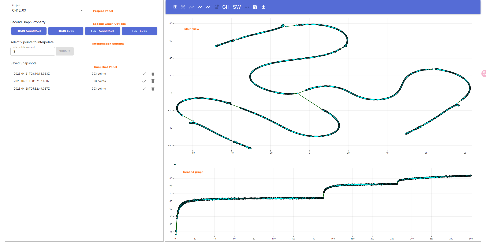
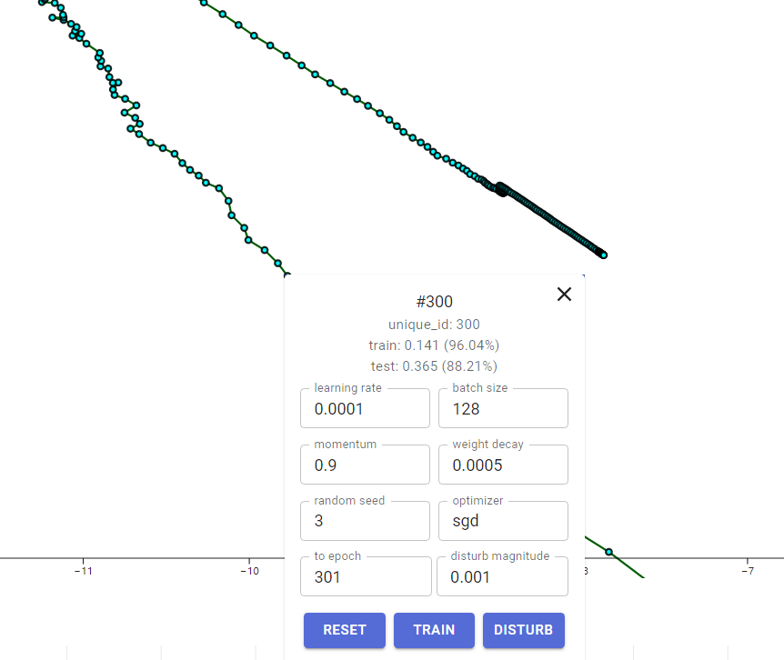

# FlowEr - A interactive visualization system for neural network training

This repo contains the frontend code for my graduation project, *Design and Implementation of a Visual Analysis System for Loss Function Sampling with Multiple Branches in Optimization Trajectories*.

# Setup

Make sure backend of [this repo](https://github.com/voidf/loss-landscape) running.

```
npm i
npm start
```

# Tutorial

The main layout look like this:



First, you should specify a project to be analyzed in the **Project Panel**. 
Then the training trajectories will be shown in the **Main view**.
Every circle in the graph represents a checkpoint which generated on the training process.

## Navigation

Use scroll to zoom the canvas. Hold *Shift* and mouse drag to pan the canvas.

## Selection

To select a subset of checkpoint, press and hold mouse left and pass through the checkpoints.
The selected checkpoints will be marked red.
To use lasso, hold *Ctrl* then draw the area to be select.
To deselect some of selected checkpoints, hold *Alt* key and do the thing explain above.

You can also use *Select All* and *Unselect All* on the toolbar.

## Projection

The projection button on toolbar will project the selected checkpoints on 2-d plane for main view showing.
Hover these button for instruction.

## Create a Branch / Continue Training

Click the checkpoint to open training menu.



Change the hyperparameter if you want or left them default to the last training. 
Click **Train** button to start training.

**Disturb magnitude** is for disturbing only. 
When **Disturb** clicked, a random vector multiply by this constant will be added to the checkpoint you selected.

# Experiment

We investigated a wide range of different architecture for image classification on CIFAR10 dataset. They are:
- LeNet
- CNN-12, CNN-24, CNN-36, CNN-48, CNN-96, CNN-48x2, CNN-48x3
- VGG-9, VGG-16
- ResNet-20, ResNet-56, ResNet-110, and the no-short-connection version of these
- DenseNet-121
- EfficientNet-s

