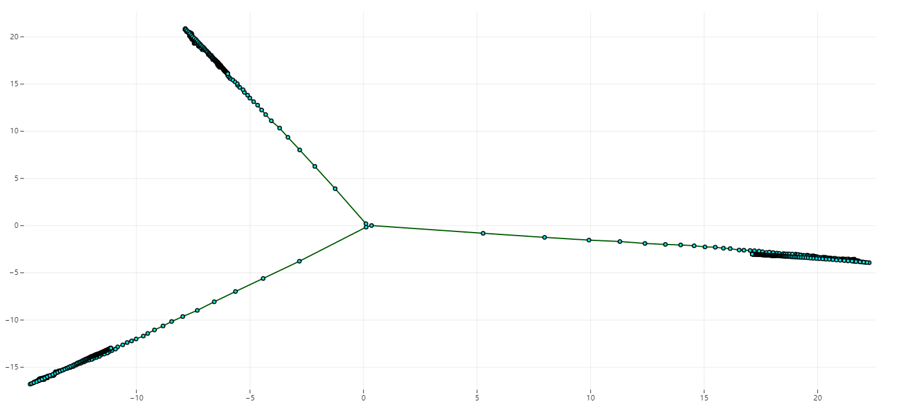
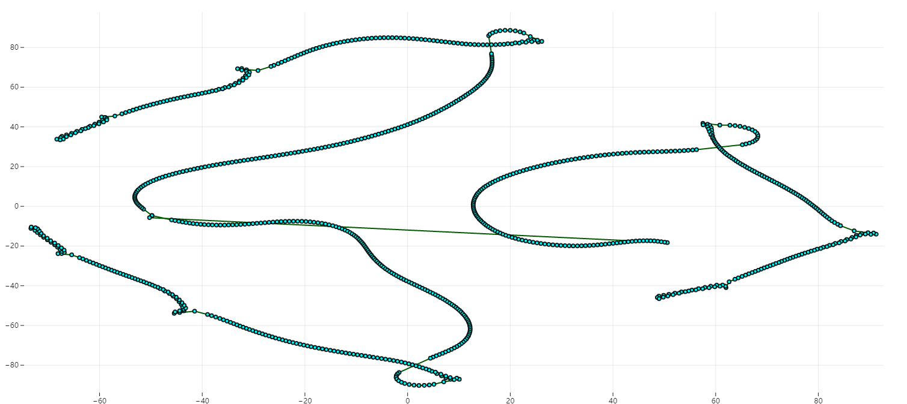
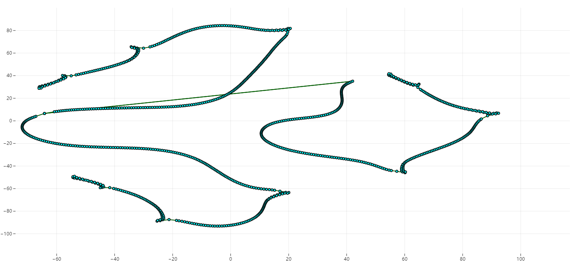

# FlowEr - A interactive visualization system for neural network training

This repo contains the frontend code for my graduation project, *Design and Implementation of a Visual Analysis System for Loss Function Sampling with Multiple Branches in Optimization Trajectories*.

# Setup

Make sure backend of [this repo](https://github.com/voidf/loss-landscape) running.

```
npm i
npm start
```

# Tutorial

The main layout look like this:


First, you should specify a project to be analyzed in the **Project Panel**. 
Then the training trajectories will be shown in the **Main view**.
Every circle in the graph represents a checkpoint which generated on the training process.

## Navigation

Use scroll to zoom the canvas. Hold *Shift* and mouse drag to pan the canvas.

## Selection

To select a subset of checkpoint, press and hold mouse left and pass through the checkpoints.
The selected checkpoints will be marked red.
To use lasso, hold *Ctrl* then draw the area to be select.
To deselect some of selected checkpoints, hold *Alt* key and do the thing explain above.

You can also use *Select All* and *Unselect All* on the toolbar.

## Projection

The projection button on toolbar will project the selected checkpoints on 2-d plane for main view showing.
Hover these button for instruction.

## Create a Branch / Continue Training

Click the checkpoint to open training menu.


Change the hyperparameter if you want or left them default to the last training. 
Click **Train** button to start training.

**Disturb magnitude** is for disturbing only. 
When **Disturb** clicked, a random vector multiply by this constant will be added to the checkpoint you selected.

## Create new project

Navigate to [http://localhost:40000/docs#/default/__newproj_post](http://localhost:40000/docs#/default/__newproj_post) and fill the initial parameter.


# Experiment

We investigated a wide range of different architecture for image classification on CIFAR10 dataset. They are:
- LeNet
- CNN-12, CNN-24, CNN-36, CNN-48, CNN-96, CNN-48x2, CNN-48x3
- VGG-9, VGG-16
- ResNet-20, ResNet-56, ResNet-110, and the no-short-connection version of these
- DenseNet-121
- EfficientNet-s

We generated 3 models for every architecture and trained them over the same preset:
- batch size: 128
- momentum: 0.9
- weight decay: 0.0005
- optimizer: sgd
- learning rate: 0.1 for first 150 epoches, then 0.01 for 151~225, 0.001 for 226~275, 0.0001 for 276~300
- data augmentation: RandomCrop and RandomHorizontalFlip

The file size of each arch is shown below:

| arch | size |
| -- | -- |
|lenet| 324K |
|cnn12| 3.01M |
|cnn24| 6.02M |
|cnn36| 9.02M |
|cnn48| 12.0M |
|cnn96| 24.0M |
|cnn48x2| 3.25M |
|cnn48x3| 1.22M |
|resnet20_noshort| 1.03M |
|resnet20| 1.04M |
|resnet56_noshort| 3.26M |
|resnet56| 3.28M |
|resnet110_noshort| 6.62M |
|resnet110| 6.63M |
|vgg9| 10.6M |
|vgg16| 57.2M |
|densenet121| 26.8M |
|effnet_s| 78.1M |

We plot these trajectories using PCA:

<!-- | arch | plot |
| -- | -- |
|LeNet||
|CNN-12||
|CNN-24||
|CNN-48||
|CNN-96||
|CNN-48x2||
|CNN-48x3||
|ResNet-20-noshort||
|ResNet-56-noshort||
|ResNet-110-noshort||
|ResNet-20||
|ResNet-56||
|ResNet-110||
|VGG-9||
|VGG-16||
|DenseNet-121||
|EfficientNet-s|| -->

<!-- Concated picture: -->


Train loss:


We plot some of these trajectories using t-SNE (we cannot plot others due to memory limit):

t-SNE arguments: 
- perplexity: 10
- iteration: 3000

| arch | plot |
| -- | -- |
|CNN-12||
|CNN-24||
|CNN-36||
|CNN-48x2||
|CNN-48x3||
|CNN-48x3||

We projected these trajectories to 50d using PCA and then use t-SNE:


An interesting picture of EfficientNet-s (the label above pink line indicates the euclidean distance between the points):


The t-sne projected plot indicated the training trajectory may looks like a triangular frustum.

~~靠，图好多，哥们摆了，自己去img文件夹看~~